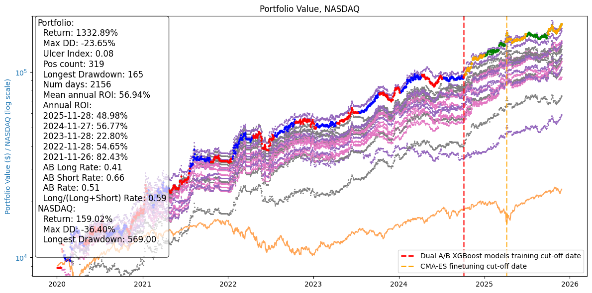
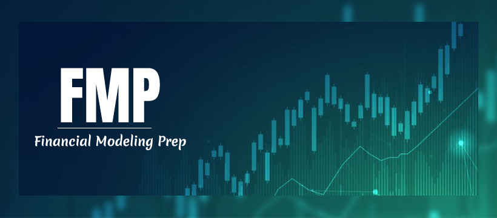

## News 🚀🚀🚀

**2025/12/06: 🔥**

- Use only stable FMP APIs.
- Prioritize "as reported" data, exclude news sites that generate fixes
- Better features ranking by importance using mean / std ^ power with multiple passes.
- Hyperparameter rework to ensure that parameter increases favor safety.
- CMA-ES hyperparameters added to the performance function to favor safety.
- Interactive Brokers order execution enabled (paper trading).
- Simplification of position management.

## My Quantitative Trading Model (MyQTM)

Welcome to MyQTM, an open-source quantitative trading framework designed to deliver robust, AI-driven investment strategies for high-growth technology stocks. This project demonstrates how to achieve strong annual returns (targeting 50% ROI) by combining structured financial data, unstructured news sentiment, and advanced machine learning techniques.

### Performance Example


### Key Features

- **Single data provider**: All financial data is sourced from    
    [Financial Modeling Prep](https://site.financialmodelingprep.com/).




- **AI-powered trading decisions**: Integrates time series data, financial indicators, and news sentiment.
- **Robust model evaluation**: Uses interlaced training/testing windows and Monte Carlo backtesting for reliability.
- **Hybrid approach**: Combines classic models (XGBoost) for structured data and LLMs for unstructured news analysis.
- **Stochastic optimization**: Hyperparameters are tuned using Covariance Matrix Adaptation Evolution Strategy (CMA-ES).
- **Transparent methodology**: All code and data processing steps are available for review and validation.

### Watch the Presentation
[](https://youtu.be/c6kNWaCAw6s)

---

> **Disclaimer:** This repository is for educational and research purposes only. It is not financial advice. Use at your own risk and only if you fully understand the algorithms and code.


## Requirements

- **Operating System:** Linux Ubuntu 24.04 or later
- **Python Version:** Python 3.11

Ubuntu 24.04, python 3.11 setup help:
```bash
sudo apt update
sudo apt install -y software-properties-common curl wget build-essential
sudo add-apt-repository ppa:deadsnakes/ppa
sudo apt update
sudo apt install -y python3.11 python3.11-venv python3.11-dev
```

Ubuntu 24.04, git setup help:
```
sudo apt install -y git
git config --global user.name "Your name "
git config --global user.email "your.email@example.com"
```

### Credentials
Setup you .env with the following credentials

- **Financial Modeling Prep (FMP):**
	- Register at [https://site.financialmodelingprep.com/](https://site.financialmodelingprep.com/)
	- Obtain your API key for financial data access
    - Add your API key in `.env`:
    ```
    FMP_APIKEY="my key"
    ```

- **Hugging Face API Key:**
	- Obtain your Hugging Face API key for model access.
    - Add your API key in `.env`:
    ```
    HUGGINEFACE_KEY="my key"
    ```

- **Google Cloud Service Account:**
	- Download a Google Cloud service account JSON file to enable vertexai (Gemini 2.0 Flash) feature from https://cloud.google.com/
    - Add your credentials in `.env`:
    ```
    GOOGLE_APPLICATION_CREDENTIALS="/home/<user>/MyQTM/service_account.json"
    PROJECT_ID="my project ID"
    ```

- **Interactive Brokers Gateway:**
	- Add your Interactive Brokers credentials in `.env`:
    ```
    TWS_USERID=<my user>
    TWS_PASSWORD=<my IB pw>
    # see credentials section
    #TWS_PASSWORD_FILE
    #TWS_USERID_PAPER=
    #TWS_PASSWORD_PAPER=
    #TWS_PASSWORD_PAPER_FILE=
    ```

- **IB Gateway Configuration:**
	- Add the following optional configurations in `.env`:
    ```
    # ib-gateway
    #TWS_SETTINGS_PATH=/home/ibgateway/Jts
    # tws
    #TWS_SETTINGS_PATH=/config/tws_settings
    TWS_SETTINGS_PATH=
    TWS_ACCEPT_INCOMING=
    TRADING_MODE=paper
    READ_ONLY_API=no
    VNC_SERVER_PASSWORD=myVncPassword
    TWOFA_TIMEOUT_ACTION=restart
    TWOFA_DEVICE=
    BYPASS_WARNING=
    AUTO_RESTART_TIME=11:59 PM
    AUTO_LOGOFF_TIME=
    TWS_COLD_RESTART=
    SAVE_TWS_SETTINGS=
    RELOGIN_AFTER_TWOFA_TIMEOUT=yes
    EXISTING_SESSION_DETECTED_ACTION=primary
    ALLOW_BLIND_TRADING=no
    CUSTOM_CONFIG=
    SSH_TUNNEL=
    SSH_OPTIONS=
    SSH_ALIVE_INTERVAL=
    SSH_ALIVE_COUNT=
    SSH_PASSPHRASE=
    SSH_REMOTE_PORT=
    SSH_USER_TUNNEL=
    SSH_RESTART=
    SSH_VNC_PORT=
    ```

### Setup this repo

```
git clone https://github.com/gdescamps/MyQTM.git
cd MyQTM
./1_setup.sh
```

#### What the setup script does

- Creates a dedicated Python 3.11 virtual environment for the project (`venv`)
- Installs all required dependencies
- Automatically downloads financial data, a pretrained model, hyperparameters, and backtest results via DVC (`dvc pull`)

### Run backtest on initial data, pretrained model, and hyperparameters

To run a backtest using the initial financial data, pretrained model, and hyperparameters:

```bash
./5_backtest.sh
```

Results will be saved in the latest folder inside `./outputs/last_benchmark`.

### Prepare a new dataset

To update the dataset to the latest available data:

1. Edit .env add your FMP API key.
2. Edit .env add your GCP service account credential.
3. Edit `src/config.py` and set `BENCHMARK_END_DATE` to today's date.
4. Run the data pipeline script:

```bash
./2_data.sh
```

This will fetch and process the latest financial data in `./data/fmp_data`.

### Retrain the model

To retrain the model on the prepared dataset, run:

```bash
./3_train.sh
```

This will update the model and save results in `./outputs/last_train`.

### Search for hyperparameters

To run hyperparameter optimization (CMA-ES) on the current dataset:

```bash
./4_search_hyperparams.sh
```

This will update the hyperparameters and save results in `./outputs/last_cma`.


### Docker Setup for Interactive Brokers Gateway

To use the `docker-compose.yml` file provided in this repository, you need to set up the Interactive Brokers Gateway Docker image. This is based on the project [ib-gateway-docker](https://github.com/gnzsnz/ib-gateway-docker).

Follow the instructions in the [ib-gateway-docker repository](https://github.com/gnzsnz/ib-gateway-docker) to build and configure the Docker image. Ensure that you have the required environment variables set in your `.env` file for proper integration with the `docker-compose.yml` configuration.


## 

## License

This project is distributed under the **PolyForm Noncommercial License 1.0.0**.

- ✅ Personal, academic, and research use allowed.  
- 🚫 Commercial use (e.g., in proprietary trading systems, financial products, or consulting services) is prohibited without written permission.  
- 💰 For commercial licensing or royalty agreements, contact: [descamps.gregory@gmail.com]

Full license text: [LICENSE](./LICENSE)